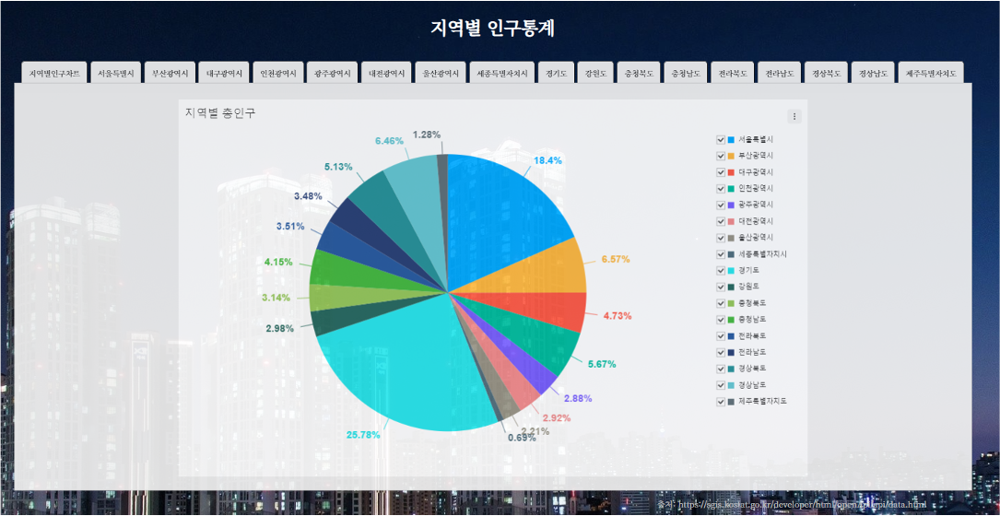
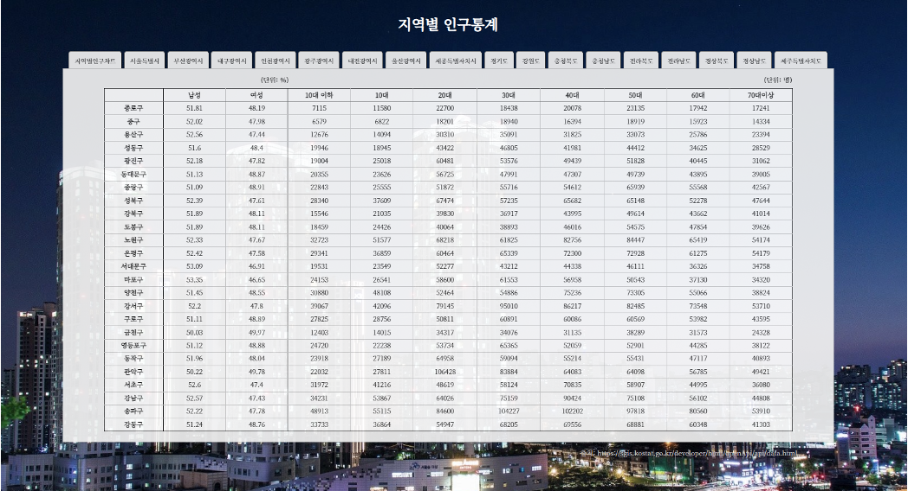

<h1 align="center">
    SGIS_OpenAPI_Project
</h1>

<br>

<div align="center">
    <h4>🛠 Stack</h4>
    
    
    

</div>

<br>

<br>

## 실행하기

-   클론 받기

    ```bash
    $ git clone git@github.com:ByeongminLee/SGIS_OpenAPI_Project.git
    ```

<br>

-   키 발급
    클론을 받고 난 뒤에 SGIS에서 API키를 발급받아야합니다.

    이 [주소](!https://sgis.kostat.go.kr/developer/html/home.html)에서 회원가입을 한뒤에 키를 발급 받을 수 있습니다.

     <br>

    key를 발급받고 <code>./js</code>경로로 <code>key.js</code>로 파일을 만들어서 다음과 같이 작성해야 합니다.

    ```js
    // ./js/key.js
    const serviceID = "[발급받은값]";
    const securityKey = "[발급받은값]";

    export { serviceID, securityKey };
    ```

    <code>key.js</code> 작성이 끝나면 정상적으로 실행 시킬 수 있습니다.

<br>

<br>

## 👋 소개

SGIS의 [총조사주요지표], [거주인구요약정보], [성별인구 요약정보] API를 활용해서 우리나라의 전체 인구를 표로 보여주고 우리나라의 시, 군, 구 단위의 지역별 10대미만 ~ 70이상까지 연령대별 인구수와 성별 비율을 화면에 보여줍니다.


|                차트                |                표                |
| :--------------------------------: | :------------------------------: |
|  |  |

<br>

<br>

## 📁 파일 구조

```
.
├── README.md
├── img
│   └── seoul.jpg
├── index.html
├── js
│   ├── key.js
│   ├── main.js
│   └── module
│       ├── get_accessToken.js
│       ├── get_admCodeMain.js
│       ├── get_admCodeSub.js
│       ├── get_ageData.js
│       ├── get_genderData.js
│       ├── print_chart.js
│       └── tab.js
└── style
    ├── reset.css
    └── style.css
```
